# 📋 Dokumentasi Functional Requirements — XENA Ticket Distribution System

> **Versi**: 1.0 — 21 Juni 2026  
> **Tujuan**: Menjadi *Single Source of Truth* agar pengembangan selanjutnya satu persepsi dengan implementasi aktual.

---

## Daftar Isi

| Req. ID | Deskripsi | Rank | Aktor |
|---------|-----------|------|-------|
| [F-01](#f-01) | Login & Dashboard sesuai Role | 1 | All |
| [F-02](#f-02) | Logout & Akhiri Sesi | 1 | All |
| [F-03](#f-03) | Reset Password via Email | 2 | All |
| [F-04](#f-04) | Update Profil & Ganti Password | 3 | All |
| [F-05](#f-05) | Notifikasi Real-Time & Mark Read | 2 | All |
| [F-06](#f-06) | Lihat Daftar Pengguna | 1 | Admin |
| [F-07](#f-07) | Tambah Pengguna Baru | 1 | Admin |
| [F-08](#f-08) | Ubah Role & Status Pengguna | 1 | Admin |
| [F-09](#f-09) | Hapus Pengguna | 1 | Admin |
| [F-10](#f-10) | Laporan Tiket dengan Filter | 2 | Admin |
| [F-11](#f-11) | Ekspor Laporan ke Excel | 2 | Admin |
| [F-12](#f-12) | Konfigurasi Sistem | 3 | Admin |
| [F-13](#f-13) | Dashboard Tim (Team Leader) | 1 | Team Leader |
| [F-14](#f-14) | Lihat Seluruh Tiket | 1 | Team Leader |
| [F-15](#f-15) | Update Informasi Tiket | 1 | Team Leader |
| [F-16](#f-16) | Assign Tiket ke Agent | 1 | Team Leader |
| [F-17](#f-17) | Riwayat Aktivitas Tiket | 2 | Team Leader |
| [F-18](#f-18) | Dashboard Pribadi Agent | 1 | Agent |
| [F-19](#f-19) | Kontrol Shift (Online/Break/End) | 1 | Agent |
| [F-20](#f-20) | Daftar Tiket Agent | 1 | Agent |
| [F-21](#f-21) | Update Konten Tiket | 1 | Agent |
| [F-22](#f-22) | Activity Log Tiket Agent | 1 | Agent |
| [F-23](#f-23) | Penyaringan Tiket by Date (TL) | 2 | Team Leader |
| [F-24](#f-24) | Penyaringan Tiket by Status (TL) | 2 | Team Leader |
| [F-25](#f-25) | Laporan Tiket Menyeluruh (Admin) | 2 | Admin |
| [F-26](#f-26) | Ekspor Laporan Excel (Admin) | 2 | Admin |

---

## Arsitektur Umum

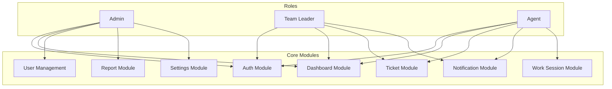

### Model Data Utama

| Model | Tabel | Primary Key | Deskripsi |
|-------|-------|-------------|-----------|
| [User](file:///d:/laragon/www/ta-xena/app/Models/User.php) | `users` | `id` | Pengguna sistem (admin, team_leader, agent) |
| [Ticket](file:///d:/laragon/www/ta-xena/app/Models/Ticket.php) | `tickets` | `idTicket` | Tiket pelanggan |
| [AgentWorkSession](file:///d:/laragon/www/ta-xena/app/Models/AgentWorkSession.php) | `agent_work_sessions` | `id` | Sesi kerja harian agent |
| [Setting](file:///d:/laragon/www/ta-xena/app/Models/Setting.php) | `settings` | `id` | Konfigurasi key-value sistem |

### Role System

| Role | Nilai DB | Helper Method |
|------|----------|---------------|
| Admin | `admin` | `$user->isAdmin()` |
| Team Leader | `team_leader` | `$user->isTeamLeader()` |
| Agent | `agent` | `$user->isAgent()` |

---

## F-01

### Login & Dashboard Sesuai Role

| Atribut | Nilai |
|---------|-------|
| **Aktor** | Semua User |
| **Rank** | 1 |
| **Route** | `GET /login`, `POST /login`, `GET /dashboard` |
| **Controller** | [AuthenticatedSessionController](file:///d:/laragon/www/ta-xena/app/Http/Controllers/Auth/AuthenticatedSessionController.php) |
| **View** | `auth.login` |

#### Alur Logika

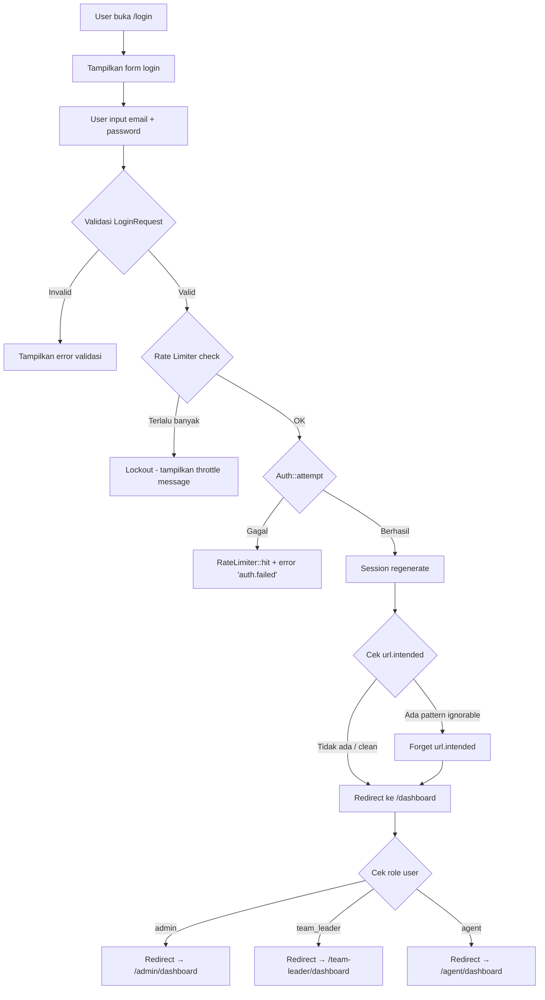

#### Detail Implementasi

1. **Validasi Login** ([LoginRequest](file:///d:/laragon/www/ta-xena/app/Http/Requests/Auth/LoginRequest.php)):
   - Field `email` → required, string, email
   - Field `password` → required, string
   - **Rate Limiting**: Maksimal 5 percobaan login gagal. Key throttle = `email|ip_address`
   - Jika melebihi batas → event `Lockout` di-trigger, tampilkan pesan throttle

2. **Post-Login Redirect** ([web.php L10-L24](file:///d:/laragon/www/ta-xena/routes/web.php#L10-L24)):
   - **Ignored URL Patterns**: Jika `url.intended` mengandung `/work-session`, `/notifications`, `/filter-tickets`, atau `/mark-read`, maka intended URL dihapus agar user tidak redirect ke API endpoint
   - Dashboard role-based menggunakan method helper `isAdmin()`, `isTeamLeader()`, `isAgent()` dari model User

3. **Middleware**: `auth`, `verified`

> [!IMPORTANT]
> Registrasi publik **dinonaktifkan**. Route register di-comment di [auth.php L15-L18](file:///d:/laragon/www/ta-xena/routes/auth.php#L15-L18). User baru hanya bisa dibuat oleh Admin (F-07).

---

## F-02

### Logout & Akhiri Sesi

| Atribut | Nilai |
|---------|-------|
| **Aktor** | Semua User |
| **Rank** | 1 |
| **Route** | `POST /logout` |
| **Controller** | [AuthenticatedSessionController::destroy](file:///d:/laragon/www/ta-xena/app/Http/Controllers/Auth/AuthenticatedSessionController.php#L53-L62) |

#### Alur Logika

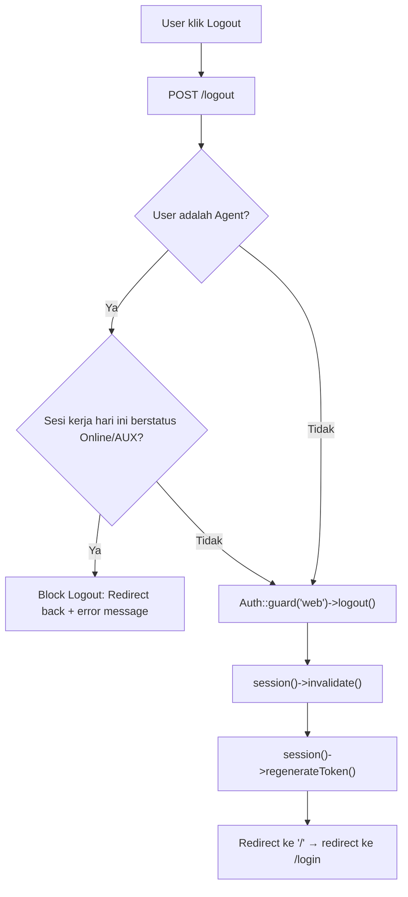

#### Detail Implementasi

1. **Validation Check**: Sebelum logout disetujui, controller memeriksa apakah pengguna yang login memiliki role `agent` dan memiliki sesi kerja (`AgentWorkSession`) aktif hari ini dengan status `'online'` atau `'aux'`.
2. **Block and Warn**: Jika agent masih dalam shift aktif (status bukan `'offline'`), proses logout akan dibatalkan (di-block), dan agent akan di-redirect kembali ke halaman sebelumnya dengan flash message/validation error agar melakukan **End Shift** terlebih dahulu.
3. **Guard logout**: Jika lolos validasi, `Auth::guard('web')->logout()` dipanggil untuk menghapus auth state dari session.
4. **Session invalidate**: Session lama dihancurkan sepenuhnya.
5. **CSRF Token regenerate**: Token CSRF baru dibuat untuk mencegah session fixation.
6. **Redirect**: Ke `/` yang kemudian di-redirect kembali ke `/login` ([web.php L6-L8](file:///d:/laragon/www/ta-xena/routes/web.php#L6-L8)).

---

## F-03

### Reset Password via Email

| Atribut | Nilai |
|---------|-------|
| **Aktor** | Semua User (guest) |
| **Rank** | 2 |
| **Route** | `GET /forgot-password`, `POST /forgot-password`, `GET /reset-password/{token}`, `POST /reset-password` |
| **Controller** | [PasswordResetLinkController](file:///d:/laragon/www/ta-xena/app/Http/Controllers/Auth/PasswordResetLinkController.php), [NewPasswordController](file:///d:/laragon/www/ta-xena/app/Http/Controllers/Auth/NewPasswordController.php) |

#### Alur Logika

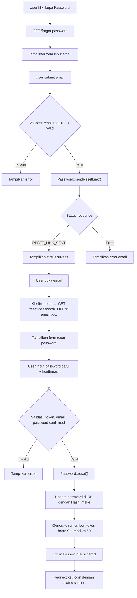

#### Detail Implementasi

1. **Custom Notification** ([CustomResetPassword](file:///d:/laragon/www/ta-xena/app/Notifications/CustomResetPassword.php)):
   - Override `sendPasswordResetNotification()` di model User
   - Mengirim email dengan subject "Reset Password - XENA"
   - Menggunakan custom email view `emails.password-reset` 
   - URL reset berisi `token` dan `email` sebagai query parameter

2. **Token Storage**: Disimpan di tabel `password_reset_tokens` (email sebagai PK)

3. **Password Rules**: Menggunakan `Rules\Password::defaults()` + `confirmed`

4. **Post-Reset**: Password di-hash ulang dengan `Hash::make()`, `remember_token` di-regenerate

> [!NOTE]
> Middleware `guest` memastikan user yang sudah login tidak bisa mengakses halaman forgot/reset password.

---

## F-04

### Update Profil & Ganti Password

| Atribut | Nilai |
|---------|-------|
| **Aktor** | Agent, Team Leader |
| **Rank** | 3 |
| **Route (Agent)** | `GET /agent/profile`, `PATCH /agent/profile`, `PATCH /agent/profile/password` |
| **Route (TL)** | `GET /team-leader/profile`, `PATCH /team-leader/profile`, `PATCH /team-leader/profile/password` |
| **Controller** | [Agent\ProfileController](file:///d:/laragon/www/ta-xena/app/Http/Controllers/Agent/ProfileController.php), [TeamLeader\ProfileController](file:///d:/laragon/www/ta-xena/app/Http/Controllers/TeamLeader/ProfileController.php) |

#### Alur Logika — Update Profil

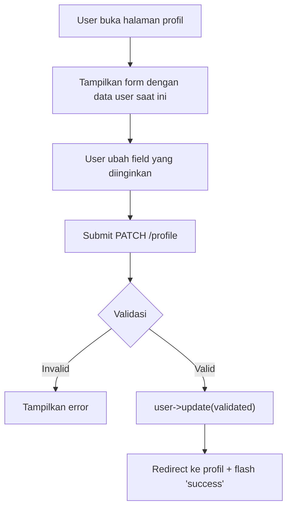

#### Validasi Profil

| Field | Rules |
|-------|-------|
| `name` | required, string, max:255 |
| `email` | required, email, max:255, unique:users (kecuali diri sendiri) |
| `campaign` | nullable, string, max:255 |
| `site` | nullable, string, max:255 |
| `username` | nullable, string, max:255 |
| `phone` | nullable, string, max:20 |

#### Alur Logika — Ganti Password

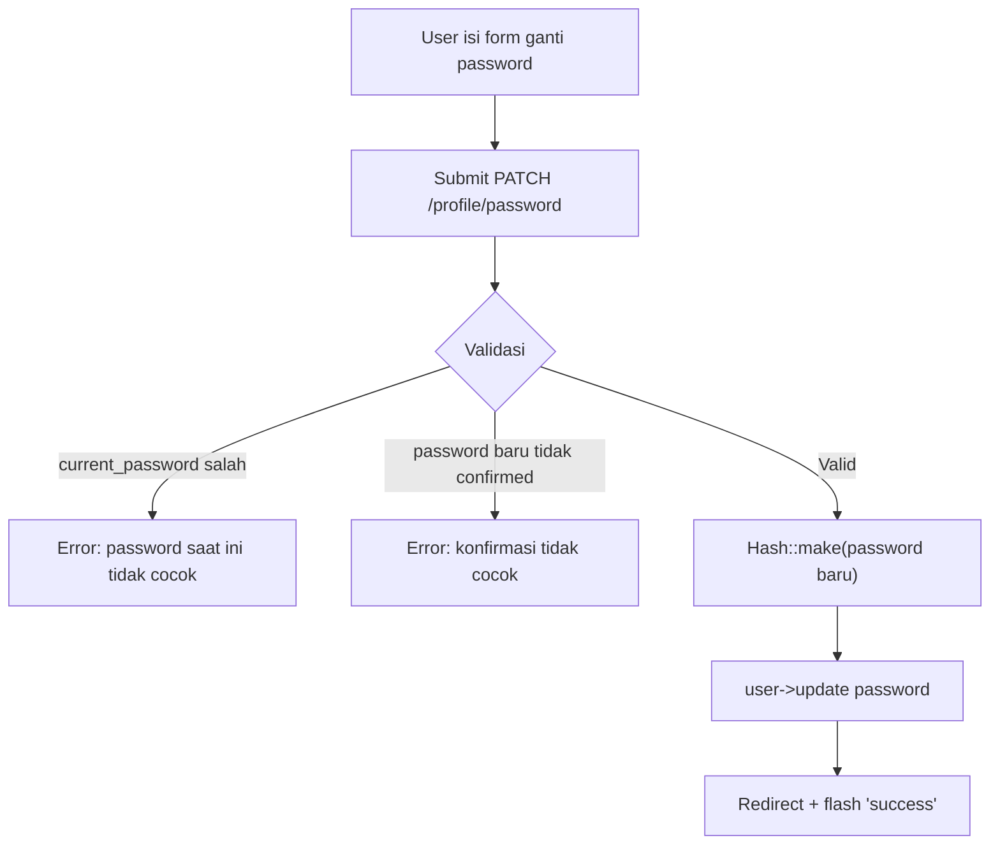

#### Validasi Password

| Field | Rules |
|-------|-------|
| `current_password` | required, current_password (auto-verify) |
| `password` | required, Password::defaults(), confirmed |

> [!NOTE]
> User **tidak** bisa mengubah `role`, `status`, atau `area` sendiri. Field tersebut hanya bisa diubah oleh Admin.

---

## F-05

### Notifikasi Real-Time & Mark Read

| Atribut | Nilai |
|---------|-------|
| **Aktor** | Semua User (terutama Agent) |
| **Rank** | 2 |
| **Route** | `GET /notifications/unread`, `GET /notifications/count`, `POST /notifications/mark-read` |
| **Controller** | [NotificationController](file:///d:/laragon/www/ta-xena/app/Http/Controllers/NotificationController.php) |

#### Alur Logika

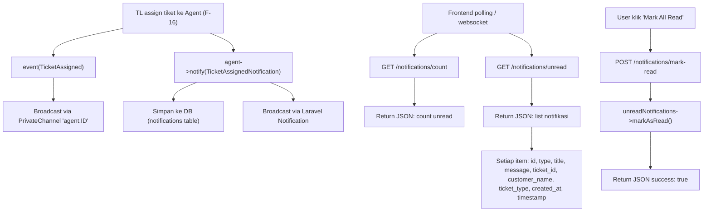

#### Detail Implementasi

1. **Event Broadcast** ([TicketAssigned](file:///d:/laragon/www/ta-xena/app/Events/TicketAssigned.php)):
   - Implements `ShouldBroadcast`
   - Channel: `PrivateChannel('agent.{agentId}')`
   - Data: `id`, `type`, `title`, `message`, `ticket_id`, `customer_name`, `ticket_type`, `created_at`

2. **Notification Class** ([TicketAssignedNotification](file:///d:/laragon/www/ta-xena/app/Notifications/TicketAssignedNotification.php)):
   - Via: `database` + `broadcast`
   - Implements `ShouldBroadcast`
   - Data tersimpan di tabel `notifications` (Laravel default)

3. **Channel Authorization** ([channels.php](file:///d:/laragon/www/ta-xena/routes/channels.php)):
   - `agent.{id}` → user ID harus cocok DAN role = 'agent'
   - `team-leader` → role harus 'team-leader'

4. **Auto Mark Read**: Saat agent membuka detail tiket, notifikasi terkait tiket tersebut otomatis di-mark read ([AgentTicketDetailController::show](file:///d:/laragon/www/ta-xena/app/Http/Controllers/Agent/TicketDetailController.php#L16-L24))

> [!TIP]
> Event `TicketDispatched` juga di-broadcast ke channel `team-leader` saat tiket di-dispatch, sehingga TL mendapat notifikasi real-time.

---

## F-06

### Lihat Daftar Seluruh Pengguna

| Atribut | Nilai |
|---------|-------|
| **Aktor** | Admin |
| **Rank** | 1 |
| **Route** | `GET /admin/users` |
| **Controller** | [Admin\UserController::index](file:///d:/laragon/www/ta-xena/app/Http/Controllers/Admin/UserController.php#L17-L23) |
| **View** | `admin.users.index` |
| **Policy** | [UserPolicy::viewAny](file:///d:/laragon/www/ta-xena/app/Policies/UserPolicy.php#L12-L15) |

#### Alur Logika

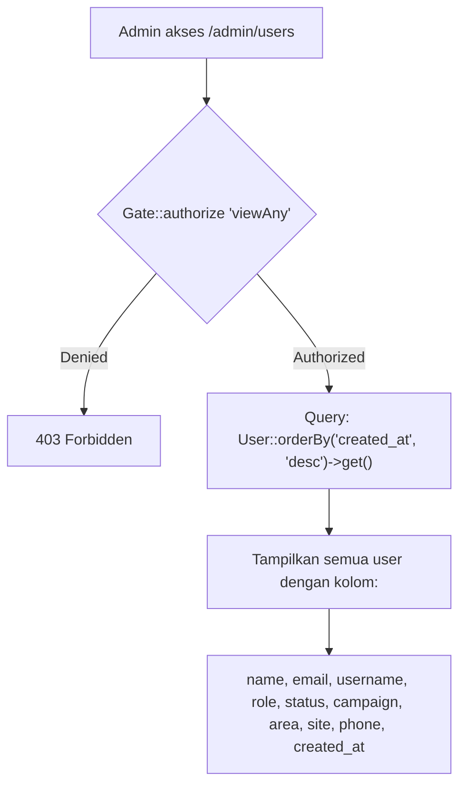

#### Detail Implementasi

1. **Authorization**: `Gate::authorize('viewAny', User::class)` → hanya `admin` atau `team_leader` yang bisa lihat list user
2. **Data**: Mengambil SEMUA user, diurutkan terbaru dulu (`created_at DESC`)
3. **Informasi ditampilkan**: name, email, username, role, status, campaign (divisi), area, site, phone

---

## F-07

### Tambah Pengguna Baru

| Atribut | Nilai |
|---------|-------|
| **Aktor** | Admin |
| **Rank** | 1 |
| **Route** | `POST /admin/users` |
| **Controller** | [Admin\UserController::store](file:///d:/laragon/www/ta-xena/app/Http/Controllers/Admin/UserController.php#L28-L50) |
| **Policy** | [UserPolicy::create](file:///d:/laragon/www/ta-xena/app/Policies/UserPolicy.php#L28-L31) |

#### Alur Logika

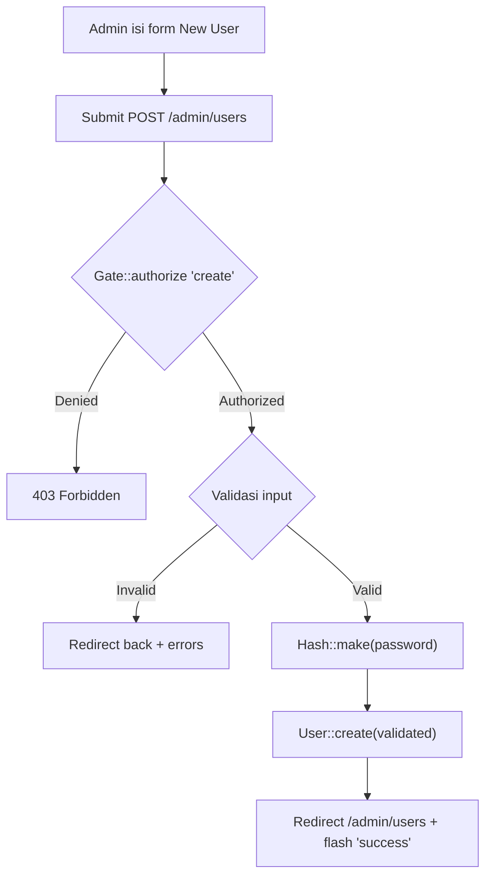

#### Validasi

| Field | Rules | Keterangan |
|-------|-------|------------|
| `name` | required, string, max:255 | Nama lengkap |
| `email` | required, email, max:255, **unique:users** | Email unik |
| `username` | required, string, max:255, **unique:users** | Username unik |
| `password` | required, string, **min:8** | Minimal 8 karakter |
| `role` | required, **in:admin,team_leader,agent** | Salah satu dari 3 role |
| `campaign` | nullable, string, max:255 | Divisi (area/besfixed/saltik) |
| `area` | nullable, string, max:255 | Area kerja |
| `site` | nullable, string, max:255 | Lokasi site |
| `phone` | nullable, string, max:20 | Nomor telepon |

> [!IMPORTANT]
> Password di-hash menggunakan `Hash::make()` sebelum disimpan. Model User juga memiliki cast `'password' => 'hashed'`, sehingga terjadi **double hashing** jika tidak hati-hati. Namun karena `Hash::make()` dipanggil eksplisit sebelum `create()`, dan cast hashed hanya berlaku pada assignment, ini aman.

---

## F-08

### Ubah Role & Status Pengguna

| Atribut | Nilai |
|---------|-------|
| **Aktor** | Admin |
| **Rank** | 1 |
| **Route** | `PATCH /admin/users/{user}/role`, `PATCH /admin/users/{user}/status` |
| **Controller** | [Admin\UserController::updateRole](file:///d:/laragon/www/ta-xena/app/Http/Controllers/Admin/UserController.php#L55-L71), [Admin\UserController::updateStatus](file:///d:/laragon/www/ta-xena/app/Http/Controllers/Admin/UserController.php#L76-L88) |
| **Policy** | [UserPolicy::updateRole](file:///d:/laragon/www/ta-xena/app/Policies/UserPolicy.php#L52-L55), [UserPolicy::updateStatus](file:///d:/laragon/www/ta-xena/app/Policies/UserPolicy.php#L60-L63) |

#### Alur Logika — Update Role (juga update campaign, site, area, status)

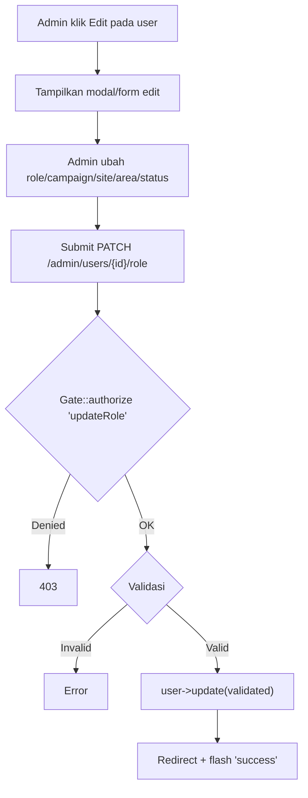

#### Validasi updateRole

| Field | Rules |
|-------|-------|
| `role` | required, in:admin,team_leader,agent |
| `campaign` | nullable, string, max:255 |
| `site` | nullable, string, max:255 |
| `area` | nullable, string, max:255 |
| `status` | required, **in:active,inactive,suspend** |

#### Validasi updateStatus

| Field | Rules |
|-------|-------|
| `status` | required, in:active,inactive,suspend |

#### Status User yang Tersedia

| Status | Deskripsi |
|--------|-----------|
| `active` | User aktif, bisa login dan bekerja |
| `inactive` | User nonaktif, tidak bisa bekerja |
| `suspend` | User di-suspend sementara |

---

## F-09

### Hapus Pengguna

| Atribut | Nilai |
|---------|-------|
| **Aktor** | Admin |
| **Rank** | 1 |
| **Route** | `DELETE /admin/users/{user}` |
| **Controller** | [Admin\UserController::destroy](file:///d:/laragon/www/ta-xena/app/Http/Controllers/Admin/UserController.php#L93-L125) |
| **Policy** | [UserPolicy::delete](file:///d:/laragon/www/ta-xena/app/Policies/UserPolicy.php#L44-L47) |

#### Alur Logika

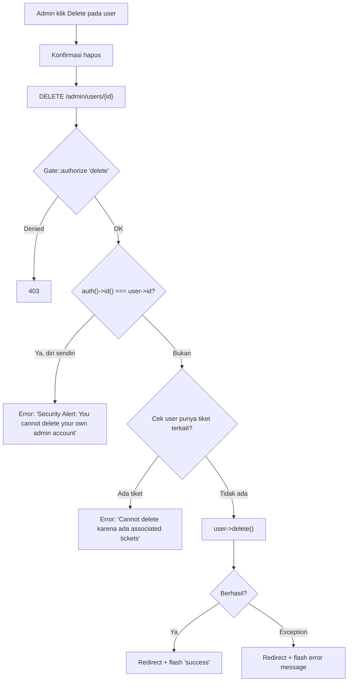

#### Aturan Bisnis (Safety Checks)

1. **Self-delete prevention**: Admin TIDAK bisa menghapus akun sendiri
2. **Referential integrity**: User TIDAK bisa dihapus jika ada tiket yang terkait (cek kolom `assignby` atau `solvedby` di tabel tickets, cocokkan dengan `email` ATAU `name` user)
3. **Policy check**: `UserPolicy::delete` memastikan hanya admin yang bisa hapus, dan bukan diri sendiri

> [!CAUTION]
> Penghapusan bersifat **permanen** (hard delete). Tidak ada soft delete atau trash. Data user hilang selamanya dari database.

---

## F-10

### Laporan Tiket dengan Filter

| Atribut | Nilai |
|---------|-------|
| **Aktor** | Admin |
| **Rank** | 2 |
| **Route** | `GET /admin/reports` (Data Harian), `GET /admin/reports/tickets` (Laporan Tiket), `GET /admin/reports/user/{user}` (Detail per User) |
| **Controller** | [Admin\ReportController](file:///d:/laragon/www/ta-xena/app/Http/Controllers/Admin/ReportController.php) |

#### Alur Logika — Data Harian (`index`)

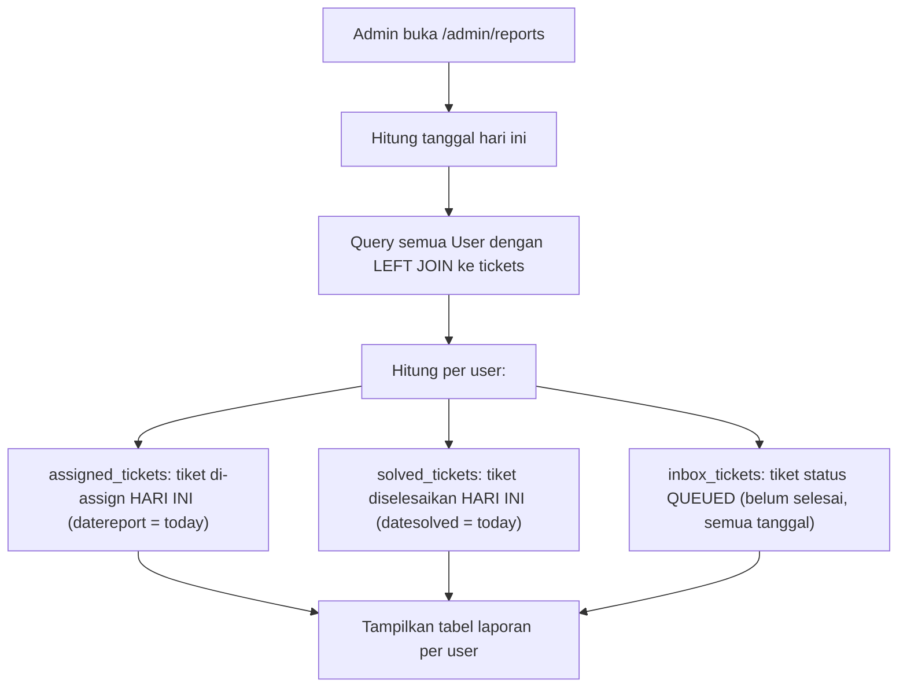

#### Alur Logika — Laporan Tiket (`ticketsReport`)

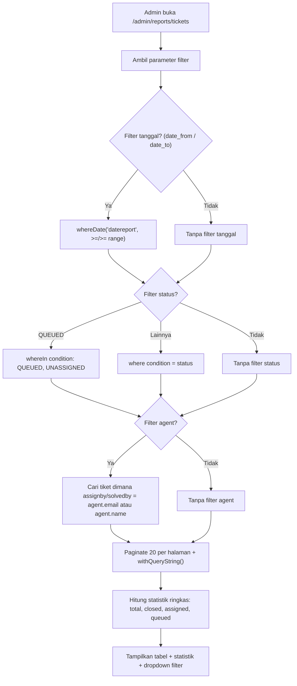

#### Filter yang Tersedia

| Parameter | Tipe | Deskripsi |
|-----------|------|-----------|
| `date_from` | date | Tanggal mulai (berdasarkan `datereport`) |
| `date_to` | date | Tanggal akhir |
| `status` | string | Filter condition (QUEUED = QUEUED + UNASSIGNED) |
| `agent_id` | integer | Filter berdasarkan agent tertentu |

#### Detail per User (`getUserTickets`)

- **Assigned tickets**: Tiket yang di-assign ke user hari ini (berdasarkan `datereport`)
- **Solved tickets**: Tiket yang diselesaikan user hari ini (berdasarkan `datesolved`)
- **Inbox tickets**: Tiket berstatus QUEUED yang di-assign ke user (semua tanggal)
- **Status counts**: Breakdown jumlah tiket per status untuk hari ini
- Return format: **JSON** (untuk AJAX modal)

---

## F-11

### Ekspor Laporan ke Excel

| Atribut | Nilai |
|---------|-------|
| **Aktor** | Admin |
| **Rank** | 2 |
| **Route** | `GET /admin/reports/export/users`, `GET /admin/reports/export/tickets`, `GET /admin/reports/export/user-tickets/{user}` |
| **Controller** | [Admin\ReportController](file:///d:/laragon/www/ta-xena/app/Http/Controllers/Admin/ReportController.php#L187-L229) |
| **Library** | `maatwebsite/excel` |

#### Alur Logika

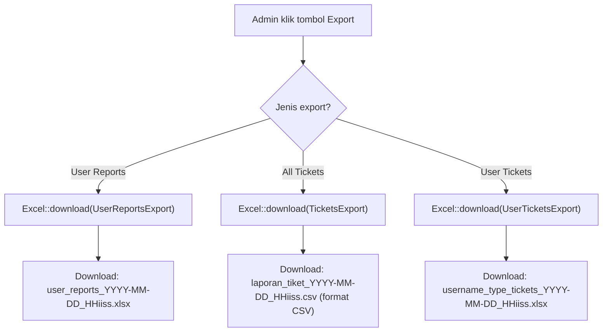

#### Export Classes

| Class | File | Format | Deskripsi |
|-------|------|--------|-----------|
| [UserReportsExport](file:///d:/laragon/www/ta-xena/app/Exports/UserReportsExport.php) | `.xlsx` | Laporan semua user beserta statistik tiket |
| [TicketsExport](file:///d:/laragon/www/ta-xena/app/Exports/TicketsExport.php) | `.csv` | Semua tiket dengan filter opsional |
| [UserTicketsExport](file:///d:/laragon/www/ta-xena/app/Exports/UserTicketsExport.php) | `.xlsx` | Tiket spesifik per user (assigned/solved/inbox) |

#### Filter Export Tiket

Export tiket (`exportAllTickets`) mendukung filter parameter:
- `user_id`, `status`, `priority`, `regional`, `witel`, `date_from`, `date_to`

---

## F-12

### Konfigurasi Sistem

| Atribut | Nilai |
|---------|-------|
| **Aktor** | Admin |
| **Rank** | 3 |
| **Route** | `GET /admin/settings`, `POST /admin/settings` |
| **Controller** | [Admin\SettingsController](file:///d:/laragon/www/ta-xena/app/Http/Controllers/Admin/SettingsController.php) |
| **Model** | [Setting](file:///d:/laragon/www/ta-xena/app/Models/Setting.php) |

#### Alur Logika

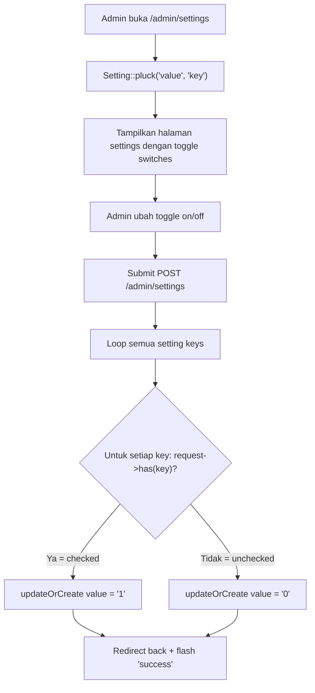

#### Setting Keys yang Dikelola

| Key | Deskripsi |
|-----|-----------|
| `auto_assign_tickets` | Toggle otomasi assign tiket |
| `email_notifications` | Toggle notifikasi email |
| `maintenance_mode` | Toggle mode maintenance |
| `push_notifications` | Toggle push notification |
| `sound_alerts` | Toggle sound alert |
| `desktop_notifications` | Toggle desktop notification |
| `two_factor_auth` | Toggle 2FA |
| `session_timeout` | Toggle session timeout |
| `ip_whitelist` | Toggle IP whitelist |

> [!NOTE]
> Semua setting disimpan sebagai key-value pairs di tabel `settings` menggunakan `updateOrCreate`. Nilai disimpan sebagai string `'1'` (aktif) atau `'0'` (nonaktif).

---

## F-13

### Dashboard Tim (Team Leader)

| Atribut | Nilai |
|---------|-------|
| **Aktor** | Team Leader |
| **Rank** | 1 |
| **Route** | `GET /team-leader/dashboard` |
| **Controller** | [TeamLeader\DashboardController](file:///d:/laragon/www/ta-xena/app/Http/Controllers/TeamLeader/DashboardController.php) |
| **View** | `team-leader.dashboard` |

#### Alur Logika

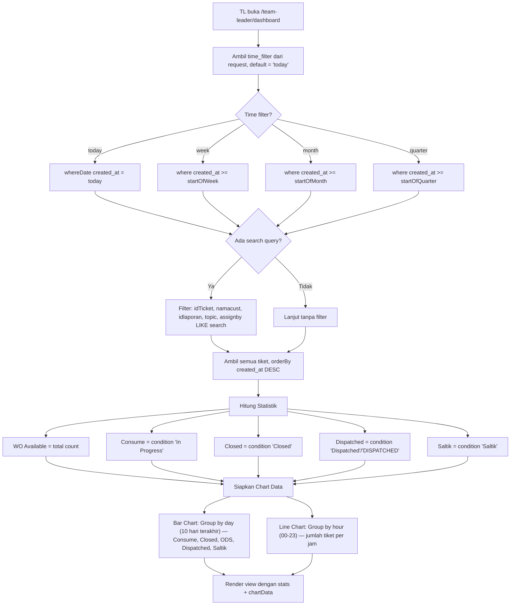

#### Data Statistik yang Ditampilkan

| Metrik | Logika |
|--------|--------|
| WO Available | Total semua tiket dalam periode filter |
| Consume | `condition = 'In Progress'` |
| ODS | Sama dengan Closed |
| Closed | `condition = 'Closed'` |
| Dispatched | `condition IN ('Dispatched', 'DISPATCHED')` |
| Saltik | `condition = 'Saltik'` |

#### Grafik

| Tipe | X-Axis | Y-Axis | Data Series |
|------|--------|--------|-------------|
| Bar Chart | 10 hari terakhir (tanggal) | Jumlah tiket | Consume, Closed, ODS, Dispatched, Saltik |
| Line Chart | 24 jam (00-23) | Jumlah tiket | Total tiket masuk per jam |

> [!TIP]
> Dashboard TL menampilkan **semua tiket** tanpa filter divisi. Berbeda dengan Agent yang hanya melihat tiket miliknya.

---

## F-14

### Lihat Seluruh Tiket (Team Leader)

| Atribut | Nilai |
|---------|-------|
| **Aktor** | Team Leader |
| **Rank** | 1 |
| **Route** | `GET /team-leader/tickets` |
| **Controller** | [TeamLeader\TicketController](file:///d:/laragon/www/ta-xena/app/Http/Controllers/TeamLeader/TicketController.php) |
| **View** | `team-leader.tickets` |

#### Alur Logika

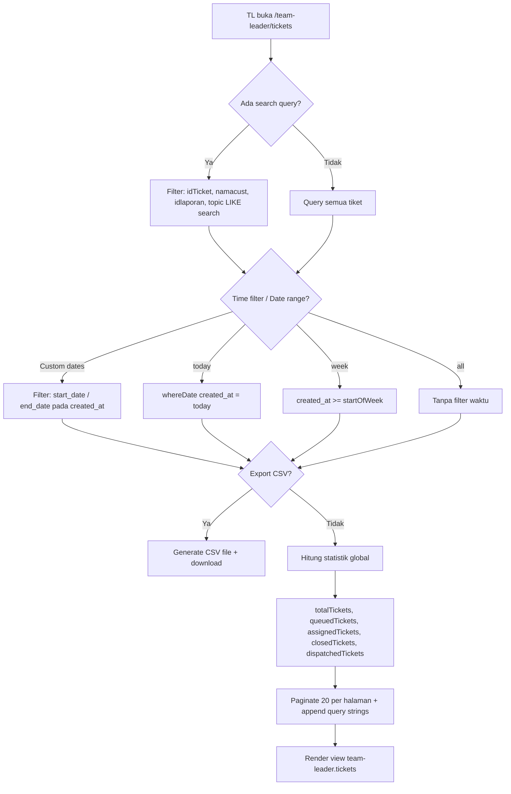

#### Filter yang Tersedia

| Filter | Parameter | Deskripsi |
|--------|-----------|-----------|
| Search | `search` | Pencarian teks di idTicket, namacust, idlaporan, topic |
| Time | `time_filter` | `all`, `today`, `week` |
| Date Range | `start_date`, `end_date` | Rentang tanggal custom |
| Export | `export=csv` | Trigger download CSV |

#### Statistik Header

| Metrik | Query |
|--------|-------|
| Total | Count semua tiket (sesuai filter) |
| Queued | `status = 'QUEUED'` |
| Assigned | `status = 'ASSIGNED'` |
| Closed | `condition IN ('Closed', 'Saltik')` |
| Dispatched | `condition IN ('Dispatched', 'DISPATCHED') OR status IN ('DISPATCHED', 'Dispatched')` |

#### CSV Export

- Separator: `;` (semicolon)
- Encoding: UTF-8 with BOM (untuk kompatibilitas Excel)
- Kolom: Ticket Code, Customer Name, Phone, Date, Status, Condition, Assigned To, Regional, Witel, Topic, Topic Detail, No SC, Status SC, Validate Close
- Ticket Code format: `TK` + zero-padded 6 digit

---

## F-15

### Update Informasi Tiket (Team Leader)

| Atribut | Nilai |
|---------|-------|
| **Aktor** | Team Leader |
| **Rank** | 1 |
| **Route** | `POST /team-leader/tickets/{id}/update`, `POST /team-leader/tickets/{id}/status` |
| **Controller** | [TeamLeader\TicketDetailController](file:///d:/laragon/www/ta-xena/app/Http/Controllers/TeamLeader/TicketDetailController.php) |

#### Alur Logika — Update Data Tiket

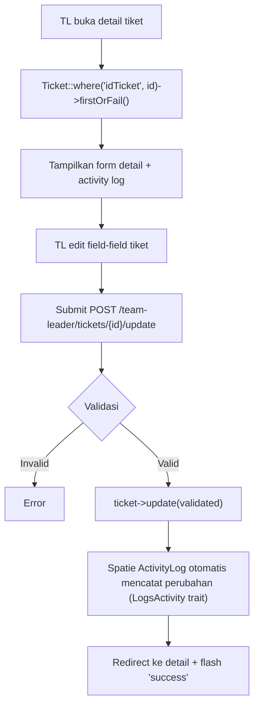

#### Field yang Dapat Diubah TL

| Field | Tipe | Deskripsi |
|-------|------|-----------|
| `resume` | nullable, string | Resume/ringkasan tiket |
| `klasifikasi` | nullable, string | Klasifikasi tiket |
| `topic` | nullable, string | Topik utama |
| `topicDetail` | nullable, string | Detail topik |
| `noSC` | nullable, string | Nomor SC |
| `statusSC` | nullable, string | Status SC |
| `validateClose` | nullable, string | Validasi close |
| `reasonnoODS` | nullable, string | Alasan no ODS |
| `eksalasiTicket` | nullable, string | Eskalasi tiket |
| `eksalasiVia` | nullable, string | Media eskalasi |
| `PIC` | nullable, string | Person In Charge |
| `contact` | nullable, string | Kontak PIC |
| `responBE` | nullable, string | Respon BE |
| `description` | nullable, string | Deskripsi detail |

#### Alur Logika — Update Status Tiket

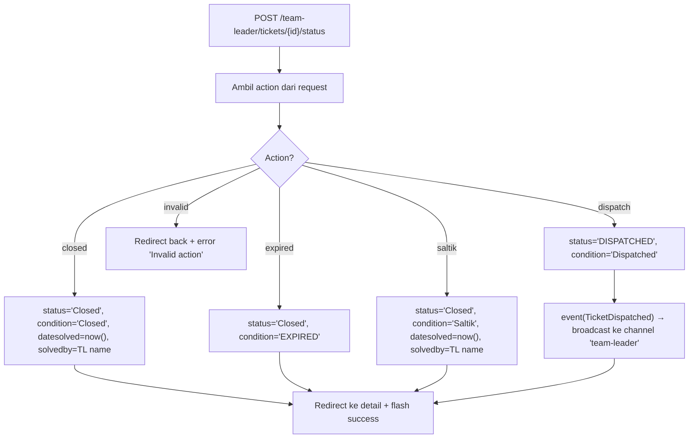

#### Status Actions

| Action | Status | Condition | Side Effects |
|--------|--------|-----------|-------------|
| `closed` | Closed | Closed | Set `datesolved` + `solvedby` |
| `expired` | Closed | EXPIRED | — |
| `saltik` | Closed | Saltik | Set `datesolved` + `solvedby` |
| `dispatch` | DISPATCHED | Dispatched | Broadcast `TicketDispatched` event |

---

## F-16

### Assign Tiket ke Agent

| Atribut | Nilai |
|---------|-------|
| **Aktor** | Team Leader |
| **Rank** | 1 |
| **Route** | `GET /team-leader/assign`, `POST /team-leader/assign/{ticket}` |
| **Controller** | [TeamLeader\AssignController](file:///d:/laragon/www/ta-xena/app/Http/Controllers/TeamLeader/AssignController.php) |

#### Alur Logika — Halaman Assign

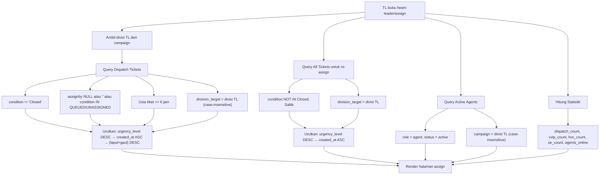

#### Alur Logika — Proses Assign

```mermaid
flowchart TD
    A["TL pilih agent + klik Assign"] --> B["POST /team-leader/assign/{ticket}"]
    B --> C{Validasi: agent_id required + exists:users}
    C -->|Invalid| D[Error]
    C -->|Valid| E{Agent dari divisi yang sama dengan TL?}
    E -->|Tidak| F["Error: 'Agent tidak berada dalam divisi Anda'"]
    E -->|Ya| G["ticket->update: assignby=agent.name, status='ASSIGNED', condition='ASSIGNED'"]
    G --> H["event(TicketAssigned) → broadcast ke PrivateChannel agent.ID"]
    H --> I["agent->notify(TicketAssignedNotification) → DB + broadcast"]
    I --> J[Redirect back + flash 'Ticket berhasil di-dispatch ke AGENT_NAME']
```

#### Prioritas Urutan Tiket di Halaman Assign

| Urutan | Kriteria | Deskripsi |
|--------|----------|-----------|
| 1 | `urgency_level DESC` | VVIP (5) → HVC (4) → Super Emergency (3) → Emergency (2) → Low (1) |
| 2 | `created_at ASC` | Tiket terlama tampil lebih dulu |
| 3 | `(lapul + gaul) DESC` | Skor lapul+gaul tertinggi dulu |

#### Aturan Bisnis

1. **Dispatch locker**: Hanya tiket yang belum di-assign DAN berusia ≥ 6 jam
2. **Division filtering**: TL hanya bisa melihat dan assign tiket sesuai divisinya
3. **Agent filtering**: Hanya agent aktif dari divisi yang sama yang muncul
4. **Online check**: Statistik `agents_online` dihitung dari `agent_work_sessions` hari ini dengan status `online`

#### Urgency Level System

| Level | Label | Badge Class |
|-------|-------|-------------|
| 5 | VVIP/Management | `urgency-vvip` |
| 4 | HVC | `urgency-hvc` |
| 3 | Super Emergency | `urgency-super` |
| 2 | Emergency | `urgency-emergency` |
| 1 (default) | Low Emergency | `urgency-low` |

---

## F-17

### Riwayat Aktivitas Tiket (Team Leader)

| Atribut | Nilai |
|---------|-------|
| **Aktor** | Team Leader |
| **Rank** | 2 |
| **Route** | `GET /team-leader/tickets/{id}` (bagian dari detail tiket) |
| **Controller** | [TeamLeader\TicketDetailController::show](file:///d:/laragon/www/ta-xena/app/Http/Controllers/TeamLeader/TicketDetailController.php#L12-L21) |
| **Library** | `spatie/laravel-activitylog` |

#### Alur Logika

```mermaid
flowchart TD
    A[TL buka detail tiket] --> B["Ticket::where('idTicket', id)->firstOrFail()"]
    B --> C["Query Activity::where(subject_type='App\\Models\\Ticket', subject_id=idTicket)"]
    C --> D["orderBy created_at DESC"]
    D --> E[Tampilkan activity log di halaman detail]
    E --> F[Setiap entry menunjukkan: waktu, field yang berubah, nilai lama → nilai baru]
```

#### Detail Implementasi

1. **Spatie Activity Log** ([Ticket model](file:///d:/laragon/www/ta-xena/app/Models/Ticket.php#L7-L8)):
   - Trait `LogsActivity` digunakan pada model Ticket
   - Config: `logAll()` → mencatat semua field
   - Config: `logOnlyDirty()` → hanya mencatat field yang berubah
   - Config: `dontSubmitEmptyLogs()` → tidak simpan log jika tidak ada perubahan

2. **Data yang Dicatat**: Setiap kali `ticket->update()` dipanggil, perubahan dicatat otomatis di tabel `activity_log` dengan:
   - `subject_type`: `App\Models\Ticket`
   - `subject_id`: `idTicket`
   - `properties`: JSON berisi `old` dan `attributes` (nilai lama dan baru)

---

## F-18

### Dashboard Pribadi Agent

| Atribut | Nilai |
|---------|-------|
| **Aktor** | Agent |
| **Rank** | 1 |
| **Route** | `GET /agent/dashboard`, `GET /agent/dashboard/filter-tickets` |
| **Controller** | [Agent\DashboardController](file:///d:/laragon/www/ta-xena/app/Http/Controllers/Agent/DashboardController.php) |
| **View** | `agent.dashboard` |

#### Alur Logika

```mermaid
flowchart TD
    A[Agent buka /agent/dashboard] --> B["Filter tiket: assignby = agent.name"]
    B --> C{Time filter?}
    C -->|today| D["whereDate created_at/updated_at = today"]
    C -->|week| E["created_at/updated_at >= startOfWeek"]
    C -->|month| F["created_at/updated_at >= startOfMonth"]
    C -->|quarter| G["created_at/updated_at >= startOfQuarter"]
    D & E & F & G --> H[Hitung Statistik Pribadi]
    H --> H1["WO Available = total tiket miliknya"]
    H --> H2["Consume = condition 'In Progress'"]
    H --> H3["Closed = condition IN ('Closed', 'Saltik')"]
    H --> H4["Dispatched = condition IN ('Dispatched', 'DISPATCHED')"]
    H --> H5["ODS = sama dengan Closed"]
    H1 & H2 & H3 & H4 & H5 --> I[Siapkan Chart Data]
    I --> J[Render view agent.dashboard]
```

#### AJAX Filter Tickets

Route: `GET /agent/dashboard/filter-tickets?start_date=...&end_date=...`

```mermaid
flowchart TD
    A[Frontend kirim AJAX request] --> B["Filter: assignby = agent.name"]
    B --> C{start_date & end_date ada?}
    C -->|Ya| D["whereBetween created_at/updated_at"]
    C -->|Tidak| E[Tanpa filter tanggal]
    D & E --> F["Return JSON: array of {code, symptomp, agent, date, status}"]
```

#### Perbedaan dengan Dashboard TL (F-13)

| Aspek | Agent Dashboard | TL Dashboard |
|-------|----------------|--------------|
| Scope | Hanya tiket milik agent (`assignby = name`) | Semua tiket |
| Time filter | Cek `created_at` ATAU `updated_at` | Hanya `created_at` |
| AJAX filter | Ada (filter-tickets endpoint) | Tidak ada |
| Work session | Terintegrasi (kontrol shift) | Tidak ada |

---

## F-19

### Kontrol Shift Agent (Online / Break / End)

| Atribut | Nilai |
|---------|-------|
| **Aktor** | Agent |
| **Rank** | 1 |
| **Route** | `GET /agent/work-session/status`, `POST /agent/work-session/toggle-online`, `POST /agent/work-session/start-aux`, `POST /agent/work-session/end-aux`, `POST /agent/work-session/end-shift` |
| **Controller** | [Agent\WorkSessionController](file:///d:/laragon/www/ta-xena/app/Http/Controllers/Agent/WorkSessionController.php) |
| **Model** | [AgentWorkSession](file:///d:/laragon/www/ta-xena/app/Models/AgentWorkSession.php) |

#### State Machine

```mermaid
stateDiagram-v2
    [*] --> Offline : Agent buka dashboard
    Offline --> Online : toggleOnline (mulai shift)
    Online --> Offline : toggleOnline (stop online)
    Online --> AUX : startAux (mulai istirahat)
    AUX --> Online : endAux (selesai istirahat)
    Online --> Offline : endShift (akhiri shift)
    AUX --> Offline : endShift (akhiri shift)
    
    note right of Online
        shift_start dicatat otomatis
        saat pertama kali online
    end note
    
    note right of AUX
        Maks 1 jam (3600 detik)
        Sisa waktu ditracking
    end note
```

#### Alur Detail — Toggle Online

```mermaid
flowchart TD
    A["POST /toggle-online"] --> B["firstOrCreate session hari ini"]
    B --> C{Status saat ini?}
    C -->|offline| D{shift_start sudah ada?}
    D -->|Belum| E["Set shift_start = now()"]
    D -->|Sudah| F[Skip set shift_start]
    E & F --> G["status = 'online', current_session_start = now()"]
    G --> H[Response: 'Anda sekarang online']
    
    C -->|online| I{current_session_start ada?}
    I -->|Ya| J[Hitung online seconds, tambahkan ke total]
    I -->|Tidak| K[Skip]
    J & K --> L["status = 'offline', current_session_start = null"]
    L --> M[Response: 'Anda sekarang offline']
    
    C -->|aux| N[Response 400: 'Sedang istirahat, selesaikan dulu']
```

#### Alur Detail — Start AUX (Break)

```mermaid
flowchart TD
    A["POST /start-aux"] --> B{Session ada & status bukan offline?}
    B -->|Tidak/offline| C[Error 400: Belum online]
    B -->|Ada| D{Status = aux?}
    D -->|Ya| E[Error 400: Sudah istirahat]
    D -->|Tidak| F{aux_remaining_seconds > 0?}
    F -->|Tidak| G[Error 400: Waktu istirahat habis]
    F -->|Ya| H[Simpan accumulated online time]
    H --> I["status = 'aux', current_session_start = now()"]
    I --> J[Response: 'Istirahat dimulai. Maks 1 jam']
```

#### Alur Detail — End AUX

```mermaid
flowchart TD
    A["POST /end-aux"] --> B{Session ada & status = aux?}
    B -->|Tidak| C[Error 400: Tidak sedang istirahat]
    B -->|Ya| D[Hitung aux_seconds dari current_session_start]
    D --> E[total_aux_seconds += aux_seconds]
    E --> F["aux_remaining_seconds = max(0, remaining - aux_seconds)"]
    F --> G["status = 'online', current_session_start = now()"]
    G --> H[Response: 'Istirahat selesai']
```

#### Alur Detail — End Shift

```mermaid
flowchart TD
    A["POST /end-shift"] --> B{Session ada & status bukan offline?}
    B -->|Tidak| C[Error 400: Tidak ada shift aktif]
    B -->|Ya| D{Status saat ini?}
    D -->|online| E[Hitung online seconds, tambah ke total]
    D -->|aux| F[Hitung aux seconds, tambah ke total + kurangi remaining]
    E & F --> G["shift_end = now()"]
    G --> H["status = 'offline', current_session_start = null"]
    H --> I[Response: 'Shift selesai. Total online time: HH:MM']
```

#### Data Model `AgentWorkSession`

| Field | Tipe | Default | Deskripsi |
|-------|------|---------|-----------|
| `user_id` | FK | — | Relasi ke User |
| `work_date` | date | — | Tanggal kerja (1 session per hari per agent) |
| `status` | string | `offline` | `online` / `offline` / `aux` |
| `shift_start` | datetime | null | Waktu mulai shift pertama kali |
| `shift_end` | datetime | null | Waktu akhir shift |
| `total_online_seconds` | integer | 0 | Akumulasi waktu online (detik) |
| `total_aux_seconds` | integer | 0 | Akumulasi waktu istirahat (detik) |
| `aux_remaining_seconds` | integer | 3600 | Sisa waktu istirahat (detik). Maks 1 jam |
| `current_session_start` | datetime | null | Waktu mulai sesi online/aux saat ini |

> [!IMPORTANT]
> Setiap agent hanya memiliki **1 work session per hari** (unik per `user_id` + `work_date`). Session dibuat otomatis saat pertama kali toggle online menggunakan `firstOrCreate`.

---

## F-20

### Daftar Tiket Agent

| Atribut | Nilai |
|---------|-------|
| **Aktor** | Agent |
| **Rank** | 1 |
| **Route** | `GET /agent/tickets` |
| **Controller** | [Agent\TicketController](file:///d:/laragon/www/ta-xena/app/Http/Controllers/Agent/TicketController.php) |
| **View** | `agent.tickets` |

#### Alur Logika

```mermaid
flowchart TD
    A[Agent buka /agent/tickets] --> B{Ada search query?}
    B -->|Ya, format INxxxxxxxx| C["Exact match: idTicket = extract number"]
    B -->|Ya, format bebas| D["LIKE match: namacust, regional, witel"]
    B -->|Tidak| E[Query tiket milik agent]
    C & D --> F["Tambah filter: assignby=name OR solvedby=name/email"]
    E --> F
    F --> G{View type?}
    G -->|active| H["condition IN ('Open', 'In Progress', 'QUEUED', 'ASSIGNED') OR condition NULL"]
    G -->|today| I["condition IN (Closed, Saltik, Dispatched, ASSIGNED, In Progress) + updated_at/datesolved = today"]
    H & I --> J[Sort dengan prioritas:]
    J --> J1["1. ASSIGNED/Dispatched tampil lebih dulu"]
    J --> J2["2. urgency_level DESC (VVIP tertinggi)"]
    J --> J3["3. datereport ASC (terlama dulu)"]
    J --> J4["4. (lapul + gaul) DESC"]
    J1 & J2 & J3 & J4 --> K["Paginate (per_page: 1/10/25/50, default 10)"]
    K --> L[Hitung statistik agent]
    L --> M[Render view agent.tickets]
```

#### View Types

| View | Parameter | Deskripsi |
|------|-----------|-----------|
| `active` (default) | `?view=active` | Tiket aktif yang masih perlu ditangani |
| `today` | `?view=today` | Log tiket yang diproses/ditutup hari ini |

#### Statistik Agent

| Metrik | Logika |
|--------|--------|
| `totalTickets` | Semua tiket yang terkait agent (assigned/solved) |
| `consumedTickets` | Tiket yang `solvedby` = agent name/email |
| `submittedTickets` | Tiket assigned ke agent dengan condition QUEUED/ASSIGNED/Open |
| `closedTickets` | Tiket solved oleh agent dengan condition Closed/Saltik |
| `dispatchedTickets` | Tiket assigned ke agent dengan condition Dispatched/DISPATCHED |

#### Urutan Prioritas Tampilan

| Prioritas | Logika | Keterangan |
|-----------|--------|------------|
| 1 | `condition = ASSIGNED` → 0 | Tiket yang baru di-assign tampil paling atas |
| 2 | `condition = Dispatched` → 1 | Tiket dispatched berikutnya |
| 3 | Lainnya → 2 | Sisa tiket |
| 4 | `urgency_level DESC` | VVIP (5) paling atas |
| 5 | `datereport ASC` | Tiket terlama dulu |
| 6 | `(lapul + gaul) DESC` | Skor lapul+gaul tertinggi |

---

## F-21

### Update Konten Tiket (Agent)

| Atribut | Nilai |
|---------|-------|
| **Aktor** | Agent |
| **Rank** | 1 |
| **Route** | `POST /agent/tickets/{id}/update`, `POST /agent/tickets/{id}/status` |
| **Controller** | [Agent\TicketDetailController](file:///d:/laragon/www/ta-xena/app/Http/Controllers/Agent/TicketDetailController.php#L57-L141) |

#### Alur Logika — Update Konten

```mermaid
flowchart TD
    A[Agent buka detail tiket] --> B["Ticket::findOrFail(id)"]
    B --> C{canEdit?}
    C -->|assignby != agent.name| D[Read-only mode]
    C -->|condition IN Closed/Dispatched/Saltik| D
    C -->|OK| E[Tampilkan form editable]
    E --> F[Agent edit field-field tiket]
    F --> G["POST /agent/tickets/{id}/update"]
    G --> H{Guard check: assignby = agent.name DAN condition bukan Closed/Dispatched/Saltik?}
    H -->|Gagal| I[Redirect + error: Akses ditolak]
    H -->|OK| J{Validasi input}
    J -->|Invalid| K[Error]
    J -->|Valid| L["ticket->update(validated)"]
    L --> M[ActivityLog otomatis mencatat perubahan]
    M --> N[Redirect ke detail + flash 'success']
```

#### Field yang Dapat Diubah Agent

| Field | Deskripsi |
|-------|-----------|
| `resume` | Ringkasan penanganan |
| `klasifikasi` | Klasifikasi tiket |
| `topic` | Topik |
| `topicDetail` | Detail topik |
| `noSC` | Nomor SC |
| `statusSC` | Status SC |
| `validateClose` | Validasi close |
| `reasonnoODS` | Alasan no ODS |
| `eksalasiTicket` | Eskalasi tiket |
| `eksalasiVia` | Media eskalasi |
| `PIC` | Person In Charge |
| `contact` | Kontak PIC |
| `responBE` | Respon BE |
| `description` | Deskripsi |
| `resolved_by_agent` | *(Khusus agent)* Penyelesaian oleh agent |
| `hasil_pengecekan` | *(Khusus agent)* Hasil pengecekan |

#### Alur Logika — Update Status (Agent)

```mermaid
flowchart TD
    A["POST /agent/tickets/{id}/status"] --> B{Guard check}
    B -->|Gagal| C[Error: Akses ditolak]
    B -->|OK| D{Action?}
    D -->|submit| E["status='In Progress', condition='In Progress'"]
    D -->|expired| F["status='Closed', condition='EXPIRED'"]
    D -->|closed| G["status='Closed', condition='Closed', datesolved=now(), solvedby=agent.name"]
    D -->|saltik| H["status='Closed', condition='Saltik', datesolved=now(), solvedby=agent.name"]
    D -->|dispatch| I["status='DISPATCHED', condition='Dispatched'"]
    I --> J["event(TicketDispatched) → broadcast ke TL"]
    E & F & G & H & J --> K[Redirect + flash success]
```

#### Perbedaan Agent vs TL pada Update Status

| Action | Agent | Team Leader |
|--------|-------|-------------|
| `submit` (In Progress) | ✅ | ❌ |
| `closed` | ✅ | ✅ |
| `expired` | ✅ | ✅ |
| `saltik` | ✅ | ✅ |
| `dispatch` | ✅ | ✅ |

> [!WARNING]
> Agent hanya bisa mengedit tiket yang **di-assign kepadanya** (`assignby = agent.name`) DAN **belum ditutup/dispatched/saltik**. Guard check ini dilakukan di server-side.

---

## F-22

### Activity Log Tiket Agent

| Atribut | Nilai |
|---------|-------|
| **Aktor** | Agent |
| **Rank** | 1 |
| **Route** | `GET /agent/tickets/{id}` (bagian dari detail tiket) |
| **Controller** | [Agent\TicketDetailController::show](file:///d:/laragon/www/ta-xena/app/Http/Controllers/Agent/TicketDetailController.php#L11-L32) |
| **Library** | `spatie/laravel-activitylog` |

#### Alur Logika

```mermaid
flowchart TD
    A[Agent buka detail tiket] --> B["Ticket::findOrFail(id)"]
    B --> C{User punya unread notification untuk tiket ini?}
    C -->|Ya| D["markAsRead() notifikasi terkait tiket"]
    C -->|Tidak| E[Skip]
    D & E --> F["Query: ticket->activities()->latest()->get()"]
    F --> G[Tampilkan activity log di halaman detail]
    G --> H["Setiap entry: waktu perubahan, field apa yang berubah, old value → new value"]
```

#### Detail Implementasi

1. **Activity Log Source**: Model Ticket menggunakan trait `LogsActivity` dari Spatie
2. **Config di Model** ([Ticket.php L36-L41](file:///d:/laragon/www/ta-xena/app/Models/Ticket.php#L36-L41)):
   - `logAll()` → semua field tercatat
   - `logOnlyDirty()` → hanya field yang berubah
   - `dontSubmitEmptyLogs()` → skip jika tidak ada perubahan
3. **Auto Mark Read**: Saat agent membuka detail tiket, notifikasi unread yang terkait tiket tersebut otomatis di-mark read

---

## F-23

### Penyaringan Tiket by Date (Team Leader)

| Atribut | Nilai |
|---------|-------|
| **Aktor** | Team Leader |
| **Rank** | 2 |
| **Route** | `GET /team-leader/assign` |
| **Controller** | [TL\AssignController::index](file:///d:/laragon/www/ta-xena/app/Http/Controllers/TeamLeader/AssignController.php) |

#### Detail Implementasi

1. **Client-Side Filtering**: Penyaringan dilakukan di frontend menggunakan JavaScript secara dinamis pada rows tabel `#ticketsTable`.
2. **Kueri Masuk**: Menggunakan input date `<input type="date" id="dateFilter">` untuk membandingkan string tanggal `YYYY-MM-DD` terhadap atribut `data-date` di setiap baris.
3. **Reset**: Tersedia tombol reset untuk mengosongkan input filter tanggal.

---

## F-24

### Penyaringan Tiket by Status (Team Leader)

| Atribut | Nilai |
|---------|-------|
| **Aktor** | Team Leader |
| **Rank** | 2 |
| **Route** | `GET /team-leader/assign` |
| **Controller** | [TL\AssignController::index](file:///d:/laragon/www/ta-xena/app/Http/Controllers/TeamLeader/AssignController.php) |

#### Detail Implementasi

1. **Status Selector**: Tombol filter status "All", "Assigned", dan "Unassigned" memicu filter JS.
2. **Attributes Matching**: Baris tabel dicocokkan berdasarkan data attribute `data-assigned="assigned"` atau `data-assigned="unassigned"`.
3. **Kombinasi Filter**: Penyaringan status bekerja bersinergi dengan filter tanggal (F-23) dan pencarian teks secara real-time.

---

## F-25

### Laporan Tiket Menyeluruh (Admin)

| Atribut | Nilai |
|---------|-------|
| **Aktor** | Admin |
| **Rank** | 2 |
| **Route** | `GET /admin/reports/tickets` |
| **Controller** | [Admin\ReportController::ticketsReport](file:///d:/laragon/www/ta-xena/app/Http/Controllers/Admin/ReportController.php#L89-L165) |

#### Detail Implementasi

1. **Multi-Filter Form**: Admin dapat menyaring tiket berdasarkan rentang tanggal masuk (`date_from` & `date_to`), status kondisi tiket, serta agent penanggung jawab.
2. **Kueri DB**: Kueri menggunakan model `Ticket` dengan relasi `assignedTo` dan `solvedBy`, memecah pagination 20 item per halaman.
3. **Statistik Summary**: Menampilkan total tiket, tiket closed, assigned, dan queued dari hasil query filter secara real-time.

---

## F-26

### Ekspor Laporan Excel (Admin)

| Atribut | Nilai |
|---------|-------|
| **Aktor** | Admin |
| **Rank** | 2 |
| **Route** | `GET /admin/reports/export/users` dan `GET /admin/reports/export/tickets` |
| **Controller** | [Admin\ReportController::exportUserReports](file:///d:/laragon/www/ta-xena/app/Http/Controllers/Admin/ReportController.php#L170-L176) dan [Admin\ReportController::exportAllTickets](file:///d:/laragon/www/ta-xena/app/Http/Controllers/Admin/ReportController.php#L181-L199) |
| **Library** | `maatwebsite/excel` (Laravel Excel) |

#### Detail Implementasi

1. **Ekspor User**: Mengunduh `.xlsx` dengan performance report user harian (total assigned, solved, inbox, data profil).
2. **Ekspor Tiket**: Mengunduh file Excel `.xlsx` yang berisi seluruh data tiket sesuai filter aktif, lengkap dengan styling warna header (`2C5F7C`), lebar kolom otomatis, dan relasi agen.

---

## Peta File ↔ Fitur

| File | F-01 | F-02 | F-03 | F-04 | F-05 | F-06 | F-07 | F-08 | F-09 | F-10 | F-11 | F-12 | F-13 | F-14 | F-15 | F-16 | F-17 | F-18 | F-19 | F-20 | F-21 | F-22 | F-23 | F-24 | F-25 | F-26 |
|------|:----:|:----:|:----:|:----:|:----:|:----:|:----:|:----:|:----:|:----:|:----:|:----:|:----:|:----:|:----:|:----:|:----:|:----:|:----:|:----:|:----:|:----:|:----:|:----:|:----:|:----:|
| [AuthenticatedSessionController](file:///d:/laragon/www/ta-xena/app/Http/Controllers/Auth/AuthenticatedSessionController.php) | ✅ | ✅ | | | | | | | | | | | | | | | | | | | | | | | | |
| [LoginRequest](file:///d:/laragon/www/ta-xena/app/Http/Requests/Auth/LoginRequest.php) | ✅ | | | | | | | | | | | | | | | | | | | | | | | | | |
| [PasswordResetLinkController](file:///d:/laragon/www/ta-xena/app/Http/Controllers/Auth/PasswordResetLinkController.php) | | | ✅ | | | | | | | | | | | | | | | | | | | | | | | |
| [NewPasswordController](file:///d:/laragon/www/ta-xena/app/Http/Controllers/Auth/NewPasswordController.php) | | | ✅ | | | | | | | | | | | | | | | | | | | | | | | |
| [CustomResetPassword](file:///d:/laragon/www/ta-xena/app/Notifications/CustomResetPassword.php) | | | ✅ | | | | | | | | | | | | | | | | | | | | | | | |
| [Agent\ProfileController](file:///d:/laragon/www/ta-xena/app/Http/Controllers/Agent/ProfileController.php) | | | | ✅ | | | | | | | | | | | | | | | | | | | | | | |
| [TL\ProfileController](file:///d:/laragon/www/ta-xena/app/Http/Controllers/TeamLeader/ProfileController.php) | | | | ✅ | | | | | | | | | | | | | | | | | | | | | | |
| [NotificationController](file:///d:/laragon/www/ta-xena/app/Http/Controllers/NotificationController.php) | | | | | ✅ | | | | | | | | | | | | | | | | | | | | | |
| [TicketAssigned](file:///d:/laragon/www/ta-xena/app/Events/TicketAssigned.php) | | | | | ✅ | | | | | | | | | | | ✅ | | | | | | | | | | |
| [TicketAssignedNotification](file:///d:/laragon/www/ta-xena/app/Notifications/TicketAssignedNotification.php) | | | | | ✅ | | | | | | | | | | | ✅ | | | | | | | | | | |
| [Admin\UserController](file:///d:/laragon/www/ta-xena/app/Http/Controllers/Admin/UserController.php) | | | | | | ✅ | ✅ | ✅ | ✅ | | | | | | | | | | | | | | | | | |
| [UserPolicy](file:///d:/laragon/www/ta-xena/app/Policies/UserPolicy.php) | | | | | | ✅ | ✅ | ✅ | ✅ | | | | | | | | | | | | | | | | | |
| [Admin\ReportController](file:///d:/laragon/www/ta-xena/app/Http/Controllers/Admin/ReportController.php) | | | | | | | | | | ✅ | ✅ | | | | | | | | | | | | | | ✅ | ✅ |
| [Admin\SettingsController](file:///d:/laragon/www/ta-xena/app/Http/Controllers/Admin/SettingsController.php) | | | | | | | | | | | | ✅ | | | | | | | | | | | | | | |
| [TL\DashboardController](file:///d:/laragon/www/ta-xena/app/Http/Controllers/TeamLeader/DashboardController.php) | | | | | | | | | | | | | ✅ | | | | | | | | | | | | | |
| [TL\TicketController](file:///d:/laragon/www/ta-xena/app/Http/Controllers/TeamLeader/TicketController.php) | | | | | | | | | | | | | | ✅ | | | | | | | | | | | | |
| [TL\TicketDetailController](file:///d:/laragon/www/ta-xena/app/Http/Controllers/TeamLeader/TicketDetailController.php) | | | | | | | | | | | | | | | ✅ | | ✅ | | | | | | | | | |
| [TL\AssignController](file:///d:/laragon/www/ta-xena/app/Http/Controllers/TeamLeader/AssignController.php) | | | | | | | | | | | | | | | | ✅ | | | | | | | ✅ | ✅ | | |
| [Agent\DashboardController](file:///d:/laragon/www/ta-xena/app/Http/Controllers/Agent/DashboardController.php) | | | | | | | | | | | | | | | | | | ✅ | | | | | | | | |
| [Agent\WorkSessionController](file:///d:/laragon/www/ta-xena/app/Http/Controllers/Agent/WorkSessionController.php) | | | | | | | | | | | | | | | | | | | ✅ | | | | | | | |
| [Agent\TicketController](file:///d:/laragon/www/ta-xena/app/Http/Controllers/Agent/TicketController.php) | | | | | | | | | | | | | | | | | | | | ✅ | | | | | | |
| [Agent\TicketDetailController](file:///d:/laragon/www/ta-xena/app/Http/Controllers/Agent/TicketDetailController.php) | | | | | ✅ | | | | | | | | | | | | | | | | ✅ | ✅ | | | | |
| [User](file:///d:/laragon/www/ta-xena/app/Models/User.php) | ✅ | | ✅ | ✅ | ✅ | ✅ | ✅ | ✅ | ✅ | ✅ | ✅ | | | | | ✅ | | | | | | | | | ✅ | ✅ |
| [Ticket](file:///d:/laragon/www/ta-xena/app/Models/Ticket.php) | | | | | | | | | | ✅ | ✅ | | ✅ | ✅ | ✅ | ✅ | ✅ | ✅ | | ✅ | ✅ | ✅ | ✅ | ✅ | ✅ | ✅ |
| [AgentWorkSession](file:///d:/laragon/www/ta-xena/app/Models/AgentWorkSession.php) | | | | | | | | | | | | | | | | ✅ | | | ✅ | | | | | | | |
| [Setting](file:///d:/laragon/www/ta-xena/app/Models/Setting.php) | | | | | | | | | | | | ✅ | | | | | | | | | | | | | | |

---

## Catatan untuk Pengembangan Selanjutnya

> [!IMPORTANT]
> ### Konvensi yang Harus Diikuti
> 1. **Role check**: Gunakan `$user->isAdmin()`, `$user->isTeamLeader()`, `$user->isAgent()` — bukan hardcode string
> 2. **Tiket ownership**: Kolom `assigned_to_user_id` menyimpan ID user (FK ke `users.id`), begitu juga `solved_by_user_id`.
> 3. **Divisi filtering (DEPRECATED)**: Konteks pemisahan divisi (area/besfixed/saltik) sekarang dinonaktifkan karena aplikasi difokuskan secara eksklusif ke lingkungan BESFIXED tunggal. Penyaluran tiket auto-assign dialihkan ke online agent secara global.
> 4. **Activity logging**: Semua perubahan tiket otomatis tercatat via Spatie ActivityLog — tidak perlu manual logging
> 5. **Notifikasi**: Untuk notifikasi real-time, gunakan pattern event + notification seperti di F-16 (TicketAssigned event + TicketAssignedNotification)
> 6. **Authorization**: Gunakan `Gate::authorize()` + Policy classes untuk kontrol akses fitur admin

> [!WARNING]
> ### Known Issues & Technical Debt
> 1. **Logout saat shift aktif (SOLVED)**: Sebelumnya agent bisa logout tanpa end shift. Sekarang, logout akan di-block jika status shift hari ini masih Online atau AUX untuk menghindari durasi kerja yang tidak valid.
> 2. **Double hashing risk (SOLVED)**: Sebelumnya ada pemanggilan manual `Hash::make()` di controller dan seeder yang tumpang tindih dengan cast `'password' => 'hashed'` model. Sekarang, enkripsi password dikelola sepenuhnya terpusat pada cast model User.
> 3. **Tiket matching by name (SOLVED)**: Kolom `assignby` dan `solvedby` (string nama) telah direfaktor penuh menjadi Foreign Key ID (`assigned_to_user_id` dan `solved_by_user_id`) untuk menjamin integritas referensial RDBMS jika nama user dirubah.
> 4. **No middleware role check (SOLVED)**: Rute-rute admin/TL/agent kini telah diproteksi dengan middleware `role:admin`, `role:agent`, dan `role:team_leader` di file `routes/web.php` untuk keamanan berlapis (*Defense in Depth*).
> 5. **Pembersihan Deteksi Divisi (SOLVED)**: Filter kampanye divisi (`campaign` dan `division_target`) pada auto-routing dan loker dispatch Team Leader telah dihapus. Tiket sekarang di-dispatch secara global ke seluruh agen aktif yang sedang online menggunakan round-robin global.
